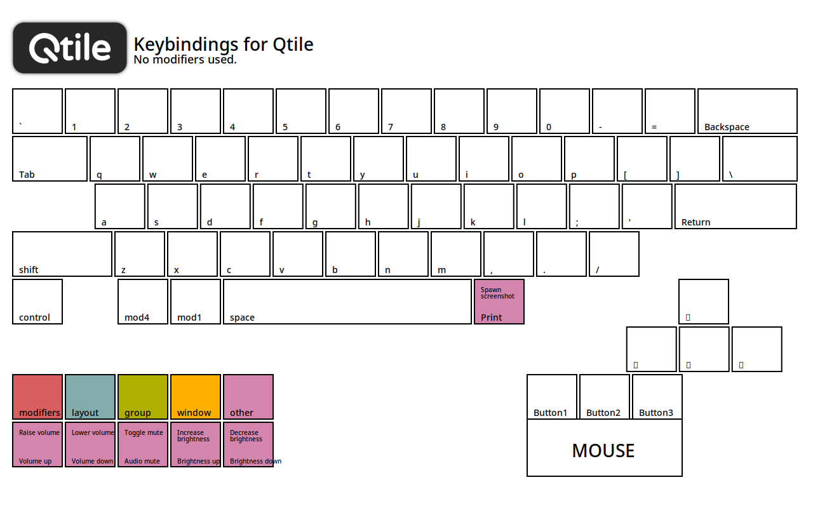
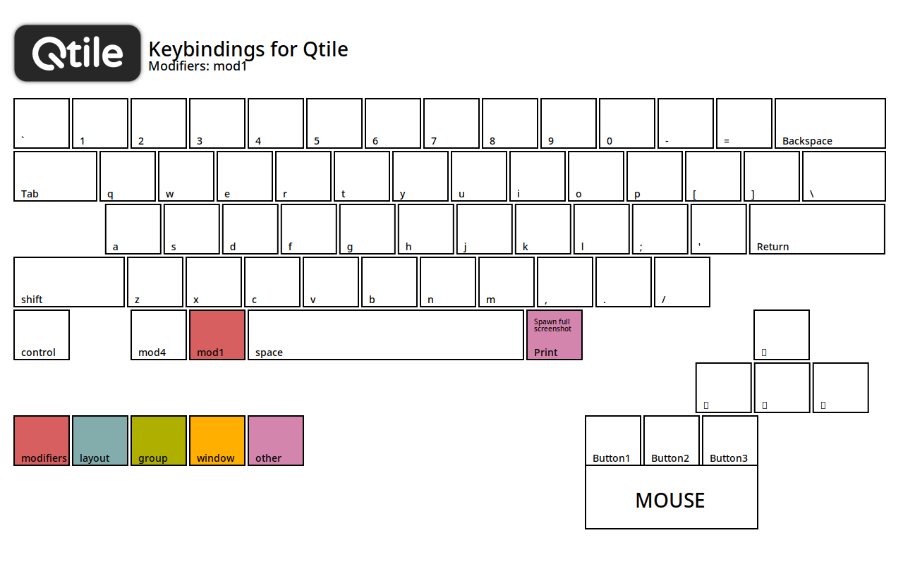
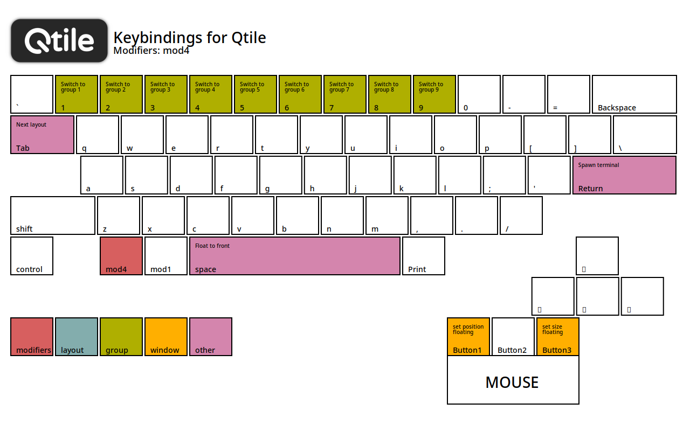
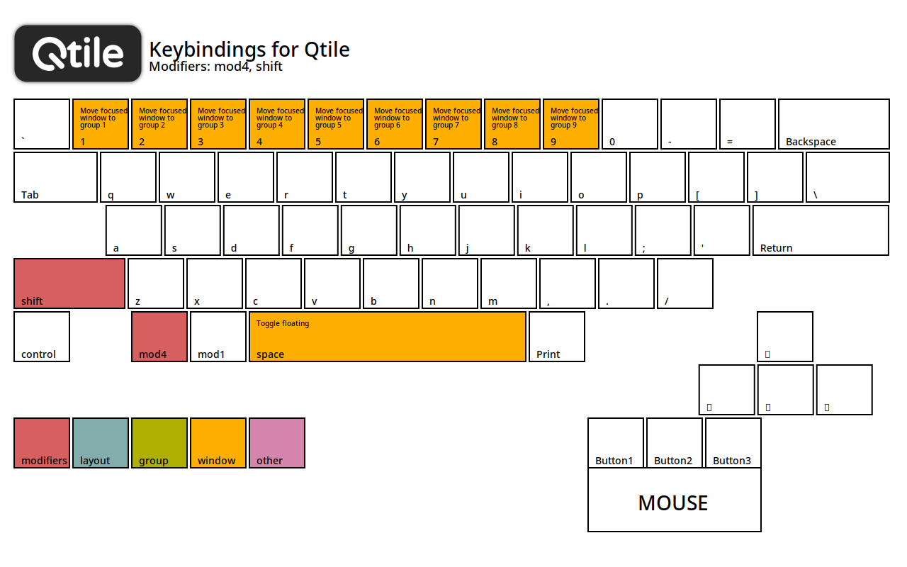
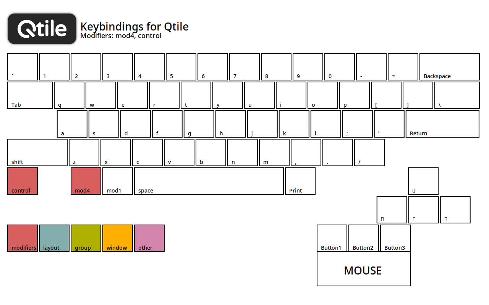
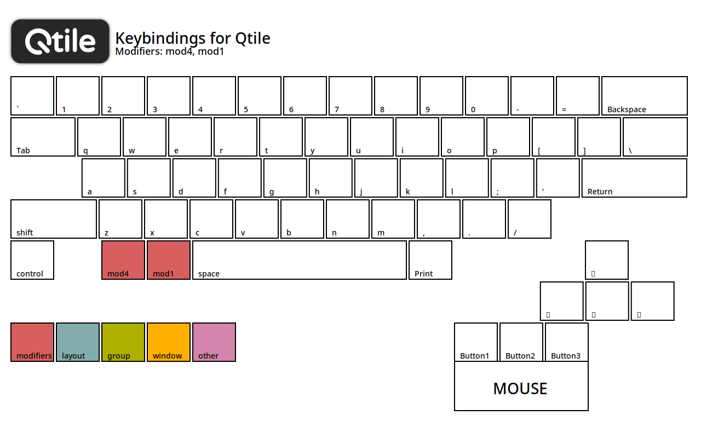

# Qtile

This is my Qtile configuration.

## Requirements

If a requirement has a an asterisk (`*`) by it, it means that you can change
this required package to whatever one you may want to replace it with.
All you have to do is change the appropriate setting in
`settings/setting.toml`.

Arch Linux

- `xorg` & `wayland`
- `light-locker`*
- `qtile`
- `python-pywlroots`
- `python-dbus-next`
- `python-pyxdg`
- `picom`
- `rofi`* & `wofi`*
- `papirus-icon-theme`
- `xdotool`* & `wtype`*
- `kitty`*
- `network-manager-applet`
- `gammastep`
- `pamixer` & `pavucontrol`*
- `xfce4-screenshooter`*
- `firefox`*
- `ttf-fira-code`
- `ttf-fira-mono`
- `ttf-fira-sans`
- `ttf-firacode-nerd`

## Keybindings

### No modifier

Keymapping image

### Mod1

Keymapping image

### Mod4

Keymapping image

### Mod4 + Shift

Keymapping image

### Mod4 + Control

Keymapping image

### Mod4 + Control

Keymapping image

